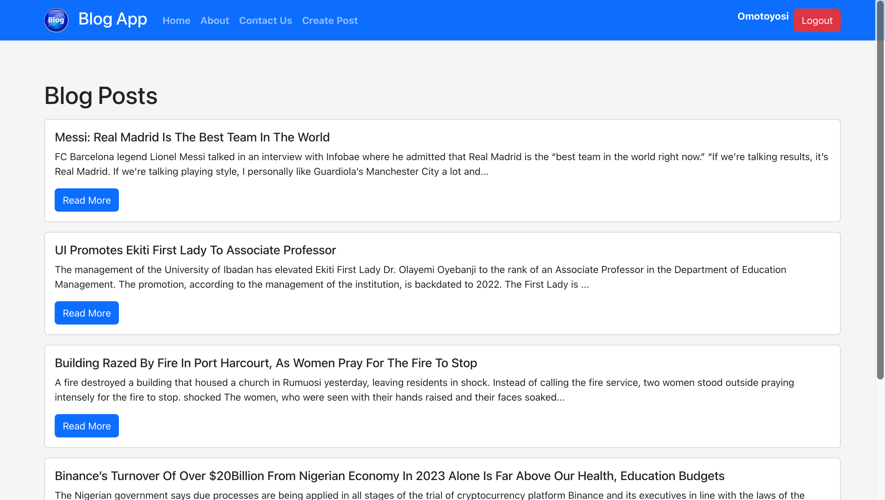

# Simple Blog App

This is a simple blog app built with React for the frontend and Node.js (Express) for the backend. It allows users to register, login, create, edit, and delete blog posts.



## Features

- User authentication (register, login, logout)
- Create, edit, and delete blog posts
- View blog posts
- Protected routes for creating, editing, and deleting posts
- Responsive design

## Technologies Used

### Frontend

- React
- React Router
- Bootstrap
- Axios

### Backend

- Node.js
- Express
- MongoDB
- Mongoose
- JSON Web Tokens (JWT) for authentication
- bcrypt for password hashing

## How to Use

### Prerequisites

- Node.js and npm installed on your machine
- MongoDB installed and running

### Installation

1. Clone the repository:

   ```bash
   git clone https://github.com/Damilordz/blog_app.git
   ```
   
2. Navigate to the project directory:
   ```
   cd blog_app
   ```
   
3. Install dependencies for both the frontend and backend:
   ```
   # Install backend dependencies
   cd backend
   npm install

   # Install frontend dependencies
   cd ../frontend
   npm install
   ```
  
4. Set up environment variables:
   - For the backend, create a .env file in the backend directory and add the following variables:
     ```
     PORT=8000
     MONGODB_URI=mongodb://localhost:27017/blog
     JWT_SECRET=your_jwt_secret
     ```
  - Replace your_jwt_secret with a random string for JWT secret.
    
5. Run the backend server:
   ```
   # Navigate to the backend directory
   cd backend

   # Start the server
   npm start
   ```
   
6. Run the frontend server:
   ```
   # Navigate to the frontend directory
   cd ../frontend

   # Start the server
   npm start
   ```
   
7. Open your web browser and visit http://localhost:3000 to use the blog app.


## Contributing

Contributions are welcome! Please open an issue or submit a pull request if you would like to contribute to this project.